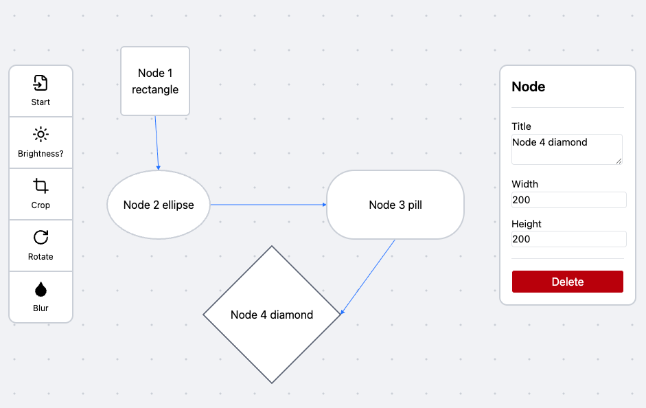

# Flow Editor

A visual workflow/diagram editor built with SolidJS and TypeScript.



## Features

- Drag and drop nodes onto a canvas
- Connect nodes with edges
- Multiple node shapes: Rectangle, Diamond, Pill, Ellipse
- Pan and zoom the canvas
- Real-time devtools overlay for debugging
- Selection sidebar for editing node/edge properties
- Delete nodes and edges

## Tech Stack

- **Framework**: SolidJS
- **Language**: TypeScript (strict mode)
- **Build**: Vite
- **Styling**: Tailwind CSS v4
- **Formatting/Linting**: Biome

## Getting Started

```bash
pnpm install
pnpm dev
```

Open [http://localhost:3000](http://localhost:3000) to view the editor.

## Commands

| Command          | Description                    |
| ---------------- | ------------------------------ |
| `pnpm dev`       | Start development server       |
| `pnpm build`     | Build for production           |
| `pnpm serve`     | Preview production build       |
| `pnpm check`     | Run Biome linter (no fixes)    |
| `pnpm check:fix` | Run Biome linter and formatter |
| `pnpm typecheck` | Run TypeScript type checking   |

## Project Structure

```
src/
├── components/
│   ├── edges/           # Edge components and utilities
│   ├── editor/          # Main editor, toolbar, and sidebar components
│   └── nodes/           # Node components, ports, and shapes
├── stores/              # SolidJS stores for state management
├── types.ts             # TypeScript type definitions
├── utils.ts             # Shared utilities
└── WorkflowApp.tsx      # Root application component
```

## Reference

I am working along the lines of this [video by Sean Shirazi](https://www.youtube.com/watch?v=EpG03RROVfk) - porting everything to SolidJS and tailwindCSS.
